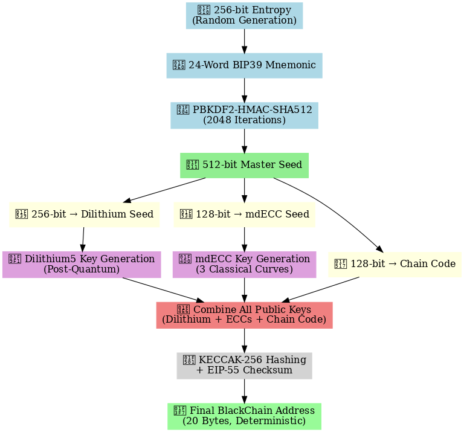

# pqc-keygen-address
Post-Quantum Key & Address Derivation using Dilithium5, mdECC, Keccak256
# 🛡️ Post-Quantum Key & Address Derivation

 <!-- Replace with your actual image file name -->

This repository demonstrates a hybrid **Post-Quantum Cryptography (PQC)** wallet system that combines:

- 🔐 **Dilithium5** – Lattice-based digital signature scheme (NIST PQC finalist)
- 🔒 **mdECC** – Multi-dimensional Elliptic Curve Cryptography (uses P-521, Curve448, E-521)
- 🔁 **SHAKE256 / PBKDF2** – Secure entropy expansion and seed derivation
- 🔄 **Keccak-256** – Ethereum-compatible address hashing
- 📬 **EIP-55** – Checksummed address formatting

The implementation is based on **Chapters 4 & 6** of the provided whitepaper and simulates a secure key and address generation process suitable for PQC-enabled blockchain platforms like **BlackChain**.

---

## 📂 Files

| File Name                                 | Description                              |
|------------------------------------------|------------------------------------------|
| `Post_Quantum_Key_&_Address_Derivation.ipynb` | Jupyter Notebook with full implementation |
| `requirements.txt`                        | Python dependencies for easy setup        |
| `README.md`                               | Project documentation                     |
| `notebook_screenshot.png`                 | Visual preview of the notebook output     |

---

## 🚀 Getting Started

### 🔧 Install dependencies

```bash
pip install pycryptodome ecdsa
